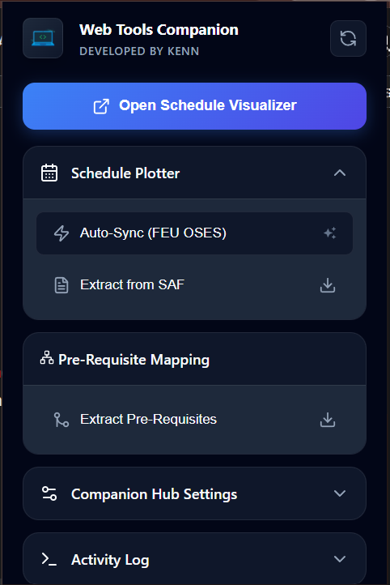
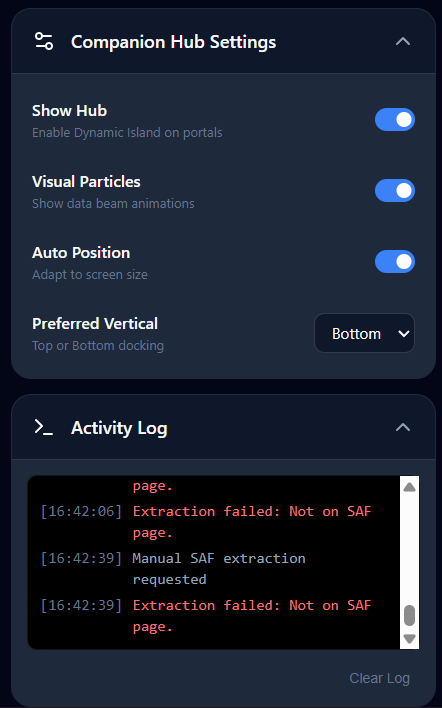
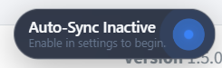
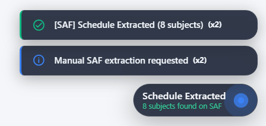
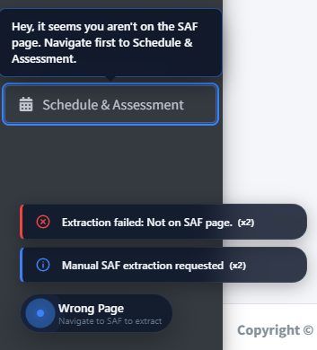
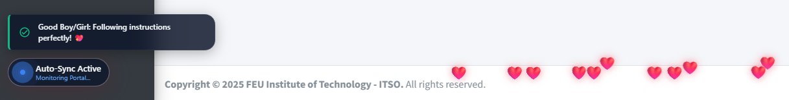
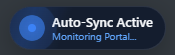
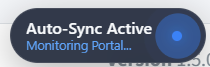

# **Web Tools Companion Extension**

### Overview
This extension is a companion tool for my [Web Tools](https://tools.kendavila.me). Developed as a Browser Extension, that interacts with certain web applications, the extension acts as the middle-man, a listener and inputs data to my Web Tools, the Web Tools themselves have listeners for the extension, ready to be used. However the user may choose not to use the companion and use the Web Tools directly, and independently.

### Features Overview

## Checklist

### Schedule Visualizer & Plotter
- [x] Auto Plotting (FEU OSES) 
- [x] Extract from SAF

### Pre-Requisite Tree
- [x] Extract Curriculum (Tree Parser)

### Companion Hub
- [x] Particle Beam Engine
- [x] Snarky Guidance System
- [x] Who's a Good Boy/Girl? (The Reward System)

### Browser Support
- [x] Chromium-based Browsers (Google Chrome, Microsoft Edge, Brave, Opera, Vivaldi, etc.)
- [ ] Gecko-based Browsers (Mozilla Firefox, Waterfox, Zen Browser, Librewolf, etc.)

# Documentations
- [Auto Plotter Flow](documentations/autoflow.md) - The synchronization architecture between the Web Tools Companion Extension, the FEU Tech School Portal (OSES), and the Schedule Visualizer (Web Tool).
- [Manual Extraction Flow](documentations/extractflow.md) - Documentation for the manual extraction of SAF schedules and Program Curriculum data.
- [Companion Hub Architecture](documentations/guide-doms.md) - Technical breakdown of the Shadow DOM-based status hub, particle beam engine, and the snarky guidance system.
- [Messaging Bridge](documentations/bridge.md) - Documentation on the cross-context communication system, payload types, and the ACK delivery assurance mechanism.

# Disclaimer
This extension is a personal project hobby that I developed for many, some functionalities are strictly for FEU students, and some are for the general public. I am not affiliated with FEU in any way, and this extension is not endorsed by FEU. The Extension aims to fix some nuance with our School Portal, and provide a better experience for my fellow students. The aforementioned features that are for FEU are Schedule Plotter & Visualizer, and Pre-Requisite Mapping, these functionalities wont work for any other school, unless requested.

# Future Plans and Requests
While the extension is currently focused on FEU students, I am open to expanding its functionality to support other schools and platforms. If you have any suggestions or requests for features, please feel free to reach out to me on this email: [gen.harpuia@outlook.ph]. Your feedback is invaluable in helping me improve the extension and make it more useful for everyone.

As the Web-Tools grows with new features, I will do my best in integrating the extension with Automated and Semi-Automated QoL features.

# Limitations
The extension currently only has an array of **CST subjects**, and their corresponding Course Code. Subject Name Will be missing if you have subjects that are missing from the CST Catalog, manual editing will be needed, but If you wish to help me expand the catalog, you can reach out to me with the Mermaid Code or HTML/MHTML using Extract Curriculum (Mapping) feature or manually Right Clicking the Portal while Program Curriculum is open, Save Page As then Save as either HRML or MHTML, and I will add it to the catalog, and credit you in the changelog.

# Screenshots

### Extension Interface
The main popup provides a quick overview of the connection status and toggleable features.

| Popup Home | Settings & Logging |
|:---:|:---:|
|  |  |

---

### Companion Hub (Dynamic Island)
Injected directly into the portal, the hub provides real-time feedback and data "beaming" animations.

| Hub States | Feedback & Toasts |
|:---:|:---:|
|  |  |

---

### Guidance & Rewards
The snarky guidance system helps you find the right page, and rewards you for being a "good human" once you follow instructions.

| Guidance (Wrong Page) | Reward System |
|:---:|:---:|
|  |  |

---

### Auto-Sync Status
Visual indicators when the extension is actively monitoring and syncing your schedule from OSES.

| Auto-Sync Left | Auto-Sync Right |
|:---:|:---:|
|  |  |

