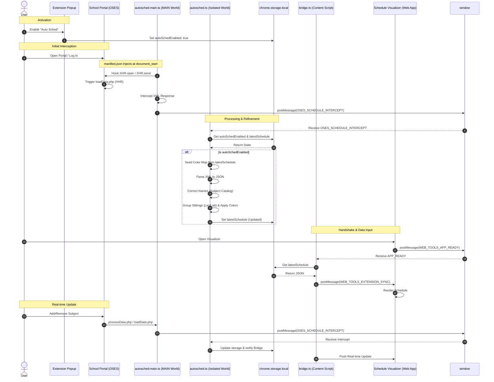
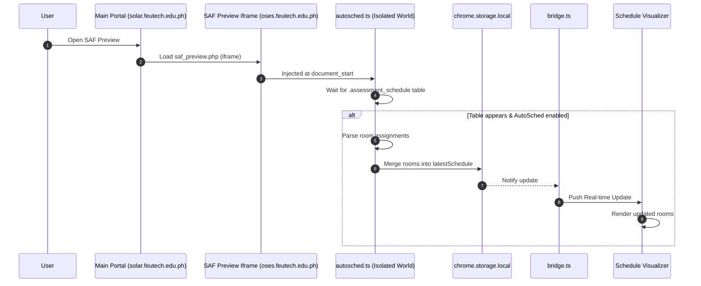

# Web Tools Companion - Auto Plotter Flow

This document outlines the synchronization architecture between the **Web Tools Companion Extension**, the **FEU Tech School Portal (OSES)**, and the **Schedule Visualizer (Web Tool)**.

## Synchronization Sequence

The following diagram illustrates the lifecycle of a schedule synchronization event, from initial activation to real-time updates. OSES operates in an iframe of a different domain `oses.feutech.edu.ph`, while the Main Portal operates at `solar.feutech.edu.ph` (Cross Domain).

## Room Assignment Flow (SAF Preview)

The extension also supports room assignment extraction from the SAF Preview page. But `saf_preview.php` isn't intercepted as XHR therefore Room Assingment cannot be automated, it relies on the user to click the **Preview SAF** button inside OSES, the extension relies on DOM observation to extract room data directly from the rendered table. While Smartly Compare the extracted data `Course Code + Section -> Room Assignment` with the existing schedule in `chrome.storage.local` and merges any new room assignments without overwriting unchanged data.

**Sequence:**

## Key Components

### 1. The Interceptor (`autosched-main.ts`)
Injected into the **MAIN** world at `document_start`. It modifies the browser's `XMLHttpRequest` prototype to catch XML payloads before the page's own scripts can finish processing them.

### 2. The Processor (`autosched.ts`)
Resides in the **ISOLATED** world. It performs the heavy lifting:
- **XML to JSON Translation:** Maps complex university XML nodes to a clean JSON schema.
- **Color Persistence:** Uses previous schedule data to ensure that adding a new subject doesn't reshuffle the colors of existing ones.
- **Sibling Logic:** Automatically detects Lecture/Lab pairs (stripping the trailing 'L') to ensure they share a consistent visual identity.

### 3. The Bridge (`bridge.ts`)
Acts as the secure communication tunnel between the Extension's storage and the Web Tool's iframe/window, ensuring data is only pushed when the user has explicitly enabled the feature.

### 4. The Visualizer
The final destination. It receives the translated JSON and renders the schedule, allowing for further manual edits and PNG exports.

# Disclaimer
While the architecture is designed to be robust against changes in the OSES portal's structure, as it relies on intercepting raw XML data rather than DOM elements. However, significant changes to the portal's API or data format may require updates to the interceptor and processor logic.