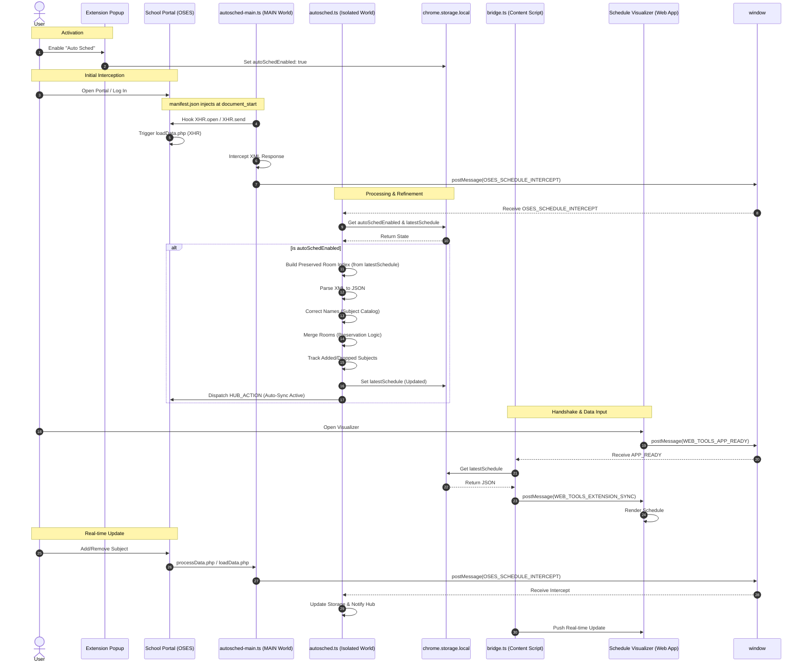
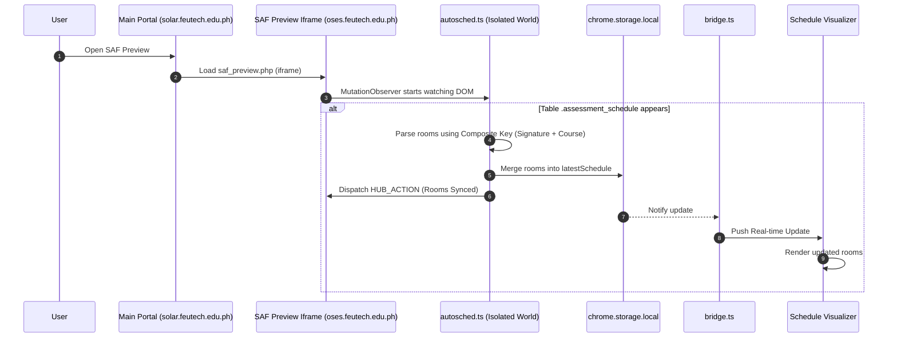

# Web Tools Companion - Auto Plotter Flow

This document outlines the synchronization architecture between the **Web Tools Companion Extension**, the **FEU Tech School Portal (OSES)**, and the **Schedule Visualizer (Web Tool)**.

## Synchronization Sequence

The following diagram illustrates the lifecycle of a schedule synchronization event, from initial activation to real-time updates. OSES operates in an iframe of a different domain `oses.feutech.edu.ph`, while the Main Portal operates at `solar.feutech.edu.ph` (Cross Domain).

## Room Assignment Flow (SAF Preview)

The extension also supports room assignment extraction from the SAF Preview page. But `saf_preview.php` isn't intercepted as XHR therefore Room Assignment cannot be automated, it relies on the user to click the **Preview SAF** button inside OSES, the extension relies on **MutationObserver** to detect the rendered table.

**Sequence:**

## Key Components

### 1. The Interceptor (`autosched-main.ts`)
Injected into the **MAIN** world at `document_start`. It modifies the browser's `XMLHttpRequest` prototype to catch XML payloads before the page's own scripts can finish processing them.

### 2. The Processor (`autosched.ts`)
Resides in the **ISOLATED** world and handles the heavy lifting:
- **XML to JSON Translation:** Maps complex university XML nodes to a clean JSON schema.
- **Room Preservation:** Since XHR payloads often lack room data, the processor builds an index of previously known rooms and merges them into the new schedule based on meeting signatures.
- **Change Tracking:** Specifically identifies "Added" or "Dropped" subjects to provide informative logs.
- **Hub Integration:** Dispatches custom events to the **Portal Hub** (UI) to show "Beaming" animations and status updates.

### 3. The Bridge (`bridge.ts`)
Acts as the secure communication tunnel between the Extension's storage and the Web Tool's iframe/window.

### 4. The Visualizer
The final destination. It receives the translated JSON and renders the schedule, allowing for further manual edits and PNG exports.

# Disclaimer
While the architecture is designed to be robust against changes in the OSES portal's structure, as it relies on intercepting raw XML data rather than DOM elements. However, significant changes to the portal's API or data format may require updates to the interceptor and processor logic.