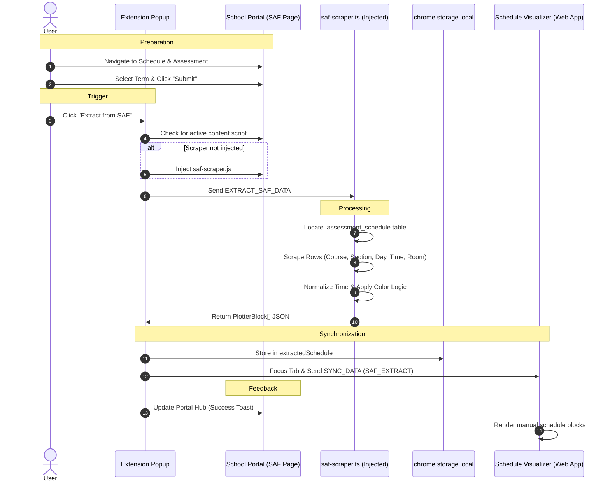
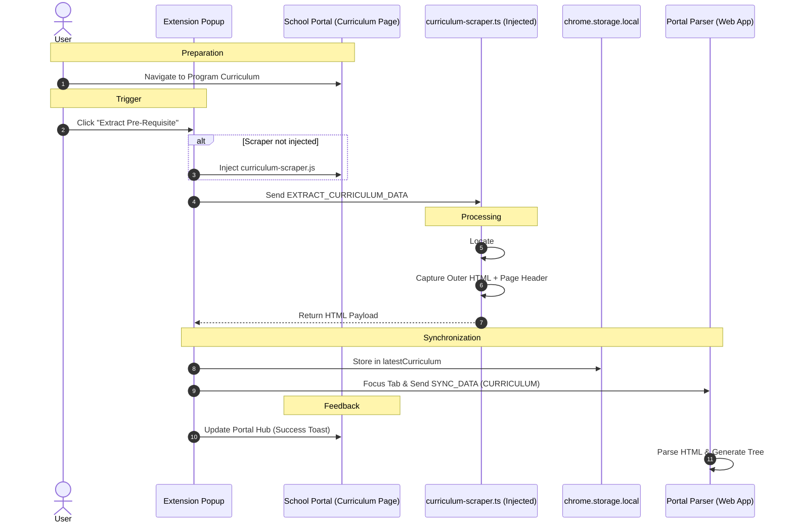

# Web Tools Companion - Manual Extraction Flows

This document outlines the manual data extraction processes for the **SAF (Schedule & Assessment)** and **Program Curriculum** using the **Web Tools Companion Extension**. These flows are used for fetching data outside of OSES Enrollment Portal when officially enrolled or when Enrollment is over. Particularly Fetching data inside a DOM element with particular table classes inside the Schedule & Assessment Page and the Program Curriculum Page of SOLAR.

## 1. Extract from SAF (Schedule)

This flow allows users to manually capture their schedule from the **Schedule & Assessment** page (SAF) when officially enrolled. Note that this is entirely separate from the `preview_saf.php` found in the enrollment portal; this SAF is generated only after selecting a Term/School Year and clicking **Submit**.

## 2. Extract Pre-Requisite (Curriculum)

This flow captures raw curriculum data directly from the **Program Curriculum** page. Unlike the SAF flow, no extra form submissions are required; simply having the curriculum table visible on the page is sufficient for extraction.

## Key Components

### 1. SAF Scraper (`saf-scraper.ts`)
A specialized content script injected on-demand. It:
- **DOM Traversal:** Specifically targets the `.assessment_schedule` table structure.
- **Data Normalization:** Converts string-based times (e.g., "07:30-09:00") into normalized start/end tokens.
- **Color Mapping:** Generates consistent colors for subject siblings (Lecture/Lab) using a hash-based color generator.

### 2. Curriculum Scraper (`curriculum-scraper.ts`)
A lightweight scraper that:
- **Context Preservation:** Captures both the `#currTable` and the page header to ensure the parser knows which program/version is being processed.
- **Raw Capture:** Instead of parsing into JSON client-side, it captures raw HTML to leverage the Web App's more powerful heuristic parsing engine.

### 3. Orchestrator (`popup.ts`)
The extension popup manages the lifecycle of these extractions:
- **Lazy Injection:** Scripts are only injected when the user initiates an extraction, keeping the extension's memory footprint low during normal browsing.
- **Tab Focusing:** Automatically finds or creates the corresponding Web Tool tab and brings it to the foreground to provide immediate visual confirmation of the sync.
- **Portal Hub Integration:** Communicates back to the portal page to show a custom "Beaming" animation and success status.

# Disclaimer
These extraction flows rely on the specific DOM structure of the FEU School Portal. Significant UI updates to the portal may require updates to the CSS selectors used in `saf-scraper.ts` and `curriculum-scraper.ts`.
